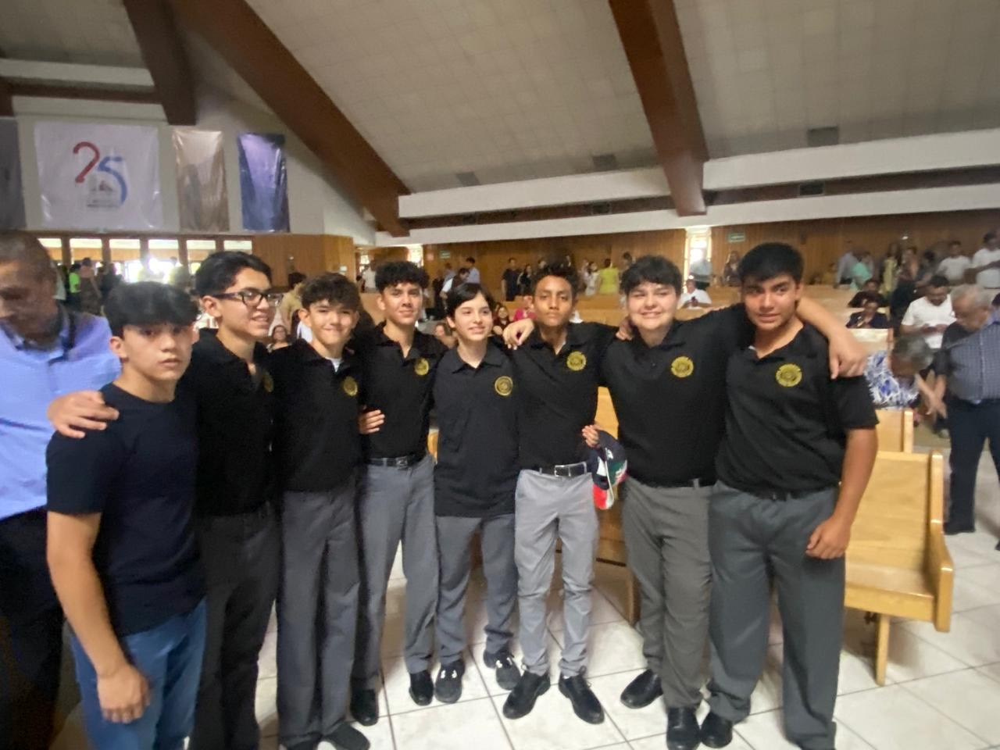

<html>
<head>
    <title>Iker Armendariz</title>
    </head>
    <body bgcolor="black" text="white" link="#000000" vlink="#000000">
    <table border="1" width="650" align="center" bgcolor="black">
    <tr>
        <td align="center">
            <h1>About me</h1>
        </td>
    </tr>
        <tr>
            <td align="center">
                
            </td>
        </tr>
            <td align="center">
                
 My name is Iker Armendariz, I was born on June 30th, 2009 in Ciudad Juarez Chihuahua Mexico. I am 15 years old, and I love playing soccer. 
                    In my free time, I enjoy playing soccer with my friends, watching games,
                    or following my favorite teams. Soccer is my passion, and it inspires me to
                    improve every day.
                

                
            </td>
        </tr>
    </table>
</body>
</html><html>
<head>
    <title>Iker Armendariz</title>
    </head>
    <body bgcolor="black" text="white" link="#000000" vlink="#000000">
    <table border="1" width="650" align="center" bgcolor="black">
    <tr>
        <td align="center">
            <h1>My family</h1>
        </td>
    </tr>
        <tr>
            <td align="center">
                
            </td>
        </tr>
            <td align="center">
                
My family is the best that I have in my life, they support me in all
                    that I want to do, they support me so I can achieve my goals, and my 
                    brother Nico is my life partner in all that I do.
                    My mom's name is Paty and my father is Sergio.
                    This past summer we went to the beach on vacation and had a great time together
                
      <html>
<head>
    <title>Iker Armendariz</title>
    </head>
    <body bgcolor="black" text="white" link="#000000" vlink="#000000">
    <table border="1" width="650" align="center" bgcolor="black">
    <tr>
        <td align="center">
            <h1>My friends</h1>
        </td>
    </tr>
        <tr>
            <td align="center">
                
            </td>
        </tr>
            <td align="center"> 
                
My friends mean a lot to me. We always have a great time together, whether we’re playing soccer,
                     hanging out or working at school. They’re the kind of people who always have my back, and I know I can count on them.
                     We share a lot of laughs and memories that make life more fun.
                

                
            </td>
        </tr>
    </table>
</body>
</html>               
     
</body>
</html>
